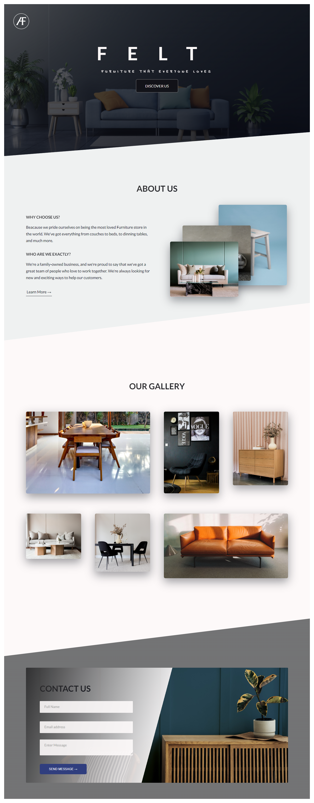

# Furniture Place

- This is a furniture store website.
- Below is a screenshot of the website.

This was a solo project. The project uses basic html5, css3 and scss.
The use of css animations made the site both appealing and interesting to browse through.

## Built With

- Html5
- css3
- scss

## Live Demo

[Live Demo Link](https://menyagah.github.io/Furniture_place/)

## Getting Started

This is a basic html5 and css3 webpage that is static. Simply clone or download the files from the github repo and click on index.html to launch the webpage.

## Author

👤 **Author1**

- Github: [@menyagah](https://github.com/menyagah)
- Twitter: [@Martinnyaga20](https://twitter.com/Martinnyaga20)
- Linkedin: [linkedin](https://www.linkedin.com/in/martin-nyagah/)

## 🤝 Contributing

Contributions, issues and feature requests are welcome!

Feel free to check the [issues page](issues/).

## Show your support

Give a ⭐️ if you like this project!

## Acknowledgments

- This is a design mockup from Beatrice Wambui Mbugua.
- LinkedIn: [beatricewambuimbugua](https://www.linkedin.com/in/beatricewambuimbugua/)
- Resource : [LinkedIn](https://www.linkedin.com/posts/beatricewambuimbugua_uxdesign-ui-activity-6926460570825019394-6Vwl?utm_source=linkedin_share&utm_medium=member_desktop_web)

## 📝 License

This project is [MIT](lic.url) licensed.
